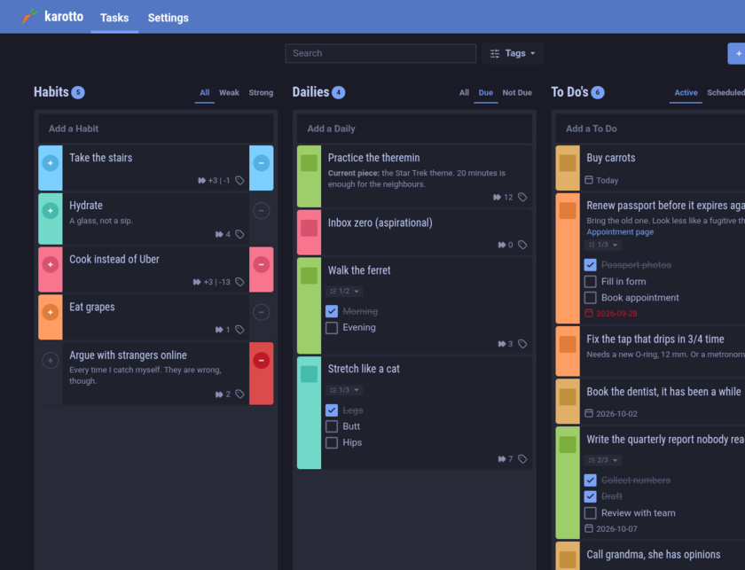
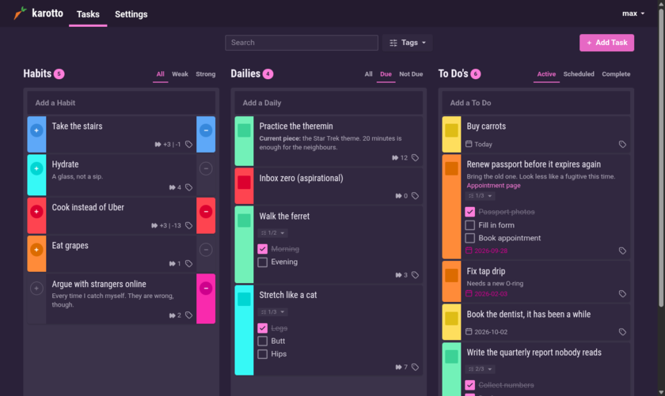
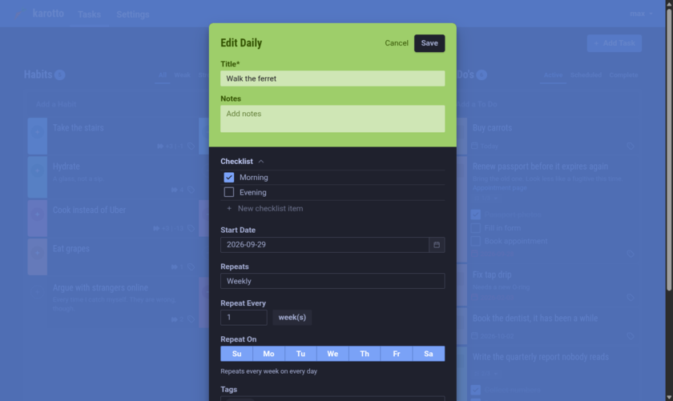
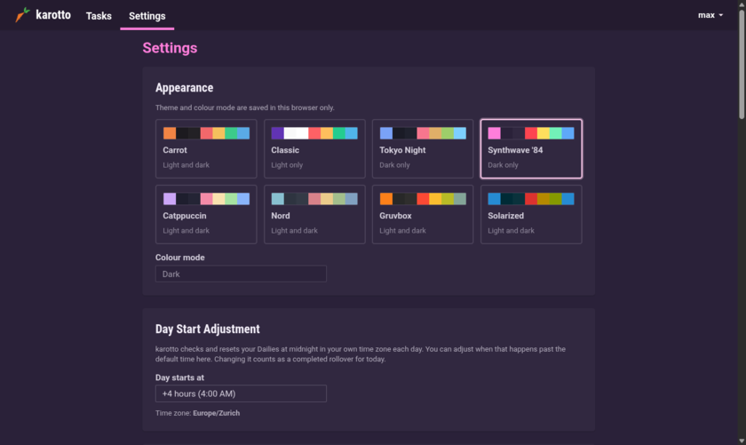
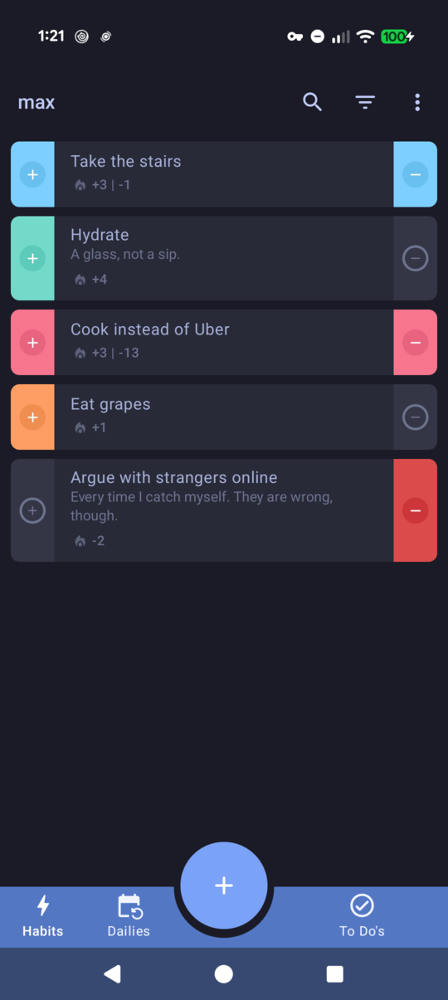
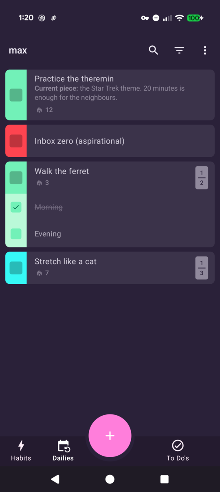
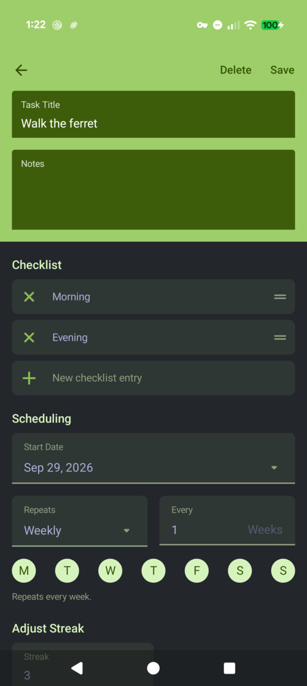

# karotto

A self-hosted habit tracker and to-do list for people who want the mechanics
of [Habitica](https://habitica.com) without the role-playing game. Habits,
dailies and to-dos; each task carries a value that drifts up when you do it
and down when you don't, and its colour shows where it stands. Streaks,
counters, repeat schedules, checklists, tags, reminders and a day rollover at
the hour you choose. No HP, XP, gold, items, avatars or popups.

Web app, native Android app, command-line client, MCP server for AI agents,
and a Home Assistant integration, all talking to one small API you run
yourself.

## Screenshots

<table>
  <tr>
    <td align="center"></td>
    <td align="center"></td>
  </tr>
  <tr>
    <td align="center">Web, Tokyo Night</td>
    <td align="center">Web, Synthwave '84</td>
  </tr>
  <tr>
    <td align="center"></td>
    <td align="center"></td>
  </tr>
  <tr>
    <td align="center">Task editor</td>
    <td align="center">Settings and themes</td>
  </tr>
</table>

<table>
  <tr>
    <td align="center"></td>
    <td align="center"></td>
    <td align="center"></td>
  </tr>
  <tr>
    <td align="center">Android, habits</td>
    <td align="center">Android, dailies</td>
    <td align="center">Android, task editor</td>
  </tr>
</table>

See `docs/DESIGN.md` for what was kept, what was dropped and where karotto
deliberately deviates from Habitica. `docs/habitica-analysis/` holds the source
analysis the implementation was derived from. Credits and licences for
everything borrowed are in `THIRD_PARTY_NOTICES.md`.

## Layout

| Package | What |
|---|---|
| `packages/core` | Shared zod schemas and pure domain logic: scheduling, scoring, rollover, colours |
| `packages/server` | Fastify API, Drizzle/Postgres, auth, CLI |
| `packages/web` | Vite + SolidJS + Tailwind client |
| `packages/android` | Native Kotlin + Jetpack Compose app, UI modelled on the Habitica Android client |
| `packages/cli` | `karotto`, the command-line client for the API, JSON output for scripts and agents |
| `skills/karotto` | Agent skill teaching the `karotto` CLI |
| `custom_components/karotto` | Home Assistant integration: to-do lists, sensors and actions, live over SSE. See `docs/HOME_ASSISTANT.md` |

## Development

Requirements: Node 24, Docker (for Postgres).

```sh
npm install
docker compose up -d db
cp .env.example .env            # defaults work with the compose database
npm run cli -w @karotto/server -- migrate
npm run cli -w @karotto/server -- user create max --timezone Europe/Zurich
npm run dev                     # API on :3210, web on :5173 (proxies /api)
```

Checks:

```sh
npm run typecheck
npm run lint
npm test
```

Themes live in `packages/core/src/theme/themes.ts`. After editing them,
regenerate the outputs both clients ship:

```sh
npm run theme:css -w @karotto/web          # Tailwind variables for the default theme
npm run themes:android -w @karotto/core    # Kotlin palettes for the Android app
```

## Android app

`packages/android` is a standalone Gradle project (not an npm workspace). It
talks to the same API with a long-lived token created through
`POST /api/v1/auth/token` from the login screen, caches tasks in Room, scores
optimistically with an offline queue, computes daily due-ness locally and
delivers reminders as exact alarms.

Requirements: JDK 21, Android SDK with platform 37. The Gradle wrapper fetches
everything else.

```sh
cd packages/android
./gradlew installDebug          # build and install on the connected device/emulator
./gradlew testDebugUnitTest     # scheduling/scoring/day-context tests
```

Server URL on the login screen:

- Emulator: `http://10.0.2.2:3210` (the host's loopback).
- Phone on the same LAN or Tailscale: start the API with `HOST=0.0.0.0` in
  `.env` and use `http://<machine-ip>:3210`. Cleartext HTTP is allowed by the
  app for that purpose; put the deployed server behind HTTPS.

## API

Everything is under `/api/v1`. Interactive docs are served at `/api/v1/docs`
(Swagger UI generated from the zod schemas), the raw spec at
`/api/v1/openapi.json`. Create a
long-lived token in Settings or with the CLI and send it as a bearer token:

```sh
npm run cli -w @karotto/server -- token create max --name scripts

curl -H "Authorization: Bearer krt_..." http://localhost:3210/api/v1/tasks
curl -X POST -H "Authorization: Bearer krt_..." -H 'content-type: application/json' \
  -d '{"type":"todo","text":"Buy carrots","alias":"carrots"}' http://localhost:3210/api/v1/tasks
curl -X POST -H "Authorization: Bearer krt_..." http://localhost:3210/api/v1/tasks/carrots/score/up
```

Task ids and aliases are interchangeable in URLs. Day rollover is triggered by
clients (`POST /api/v1/cron`), exactly like Habitica; scripts that score today's
tasks before the web app has been opened should call it first. `GET
/api/v1/cron/status` tells you whether a rollover is pending and which dailies
were due yesterday.

Live updates: `GET /api/v1/events` is a Server-Sent Events stream of changes to
the caller's data (`task.upserted`, `task.deleted`, `tasks.reordered`,
`tasks.invalidated`, `tags.changed`, `user.updated`). Send an `X-Client-Id`
header on mutating requests and the same value is echoed as `origin` on each
event, so a client can skip its own changes. The web app and the Android app
subscribe while open; a wall dashboard only needs the web app.

```sh
curl -N -H "Authorization: Bearer krt_..." http://localhost:3210/api/v1/events
```

## Command-line client

`karotto` is a separate client for humans, scripts and AI agents. It only
speaks to the API; the server's own maintenance commands are `karotto-admin`.

```sh
karotto login --url https://karotto.example.ts.net -u max   # stores a token in ~/.config/karotto
karotto tasks list --due
karotto tasks add todo "Buy carrots" --due 2026-10-03 --tag errands --alias carrots
karotto done carrots
karotto cron status --json
```

Every command takes `--json`. `KAROTTO_URL` and `KAROTTO_TOKEN` override the
stored login for scripts. `karotto mcp` runs the same operations as a Model
Context Protocol server over stdio for agents that speak MCP; register it as

```json
{ "mcpServers": { "karotto": { "command": "karotto", "args": ["mcp"] } } }
```

The deploy script installs it next to the server; elsewhere build it with
`npm run build -w @karotto/cli` and run `packages/cli/dist/main.js`.
`skills/karotto/SKILL.md` is a drop-in skill for agents that can run shell
commands.

## Server administration

Run on the server (the deploy script installs it as `karotto-admin`):

```
karotto-admin migrate
karotto-admin user create <username> [--password-stdin] [--timezone <IANA>]
karotto-admin user list | password <username> | delete <username>
karotto-admin token create <username> --name <label> [--expires <iso>]
karotto-admin token list <username> | revoke <username> <id>
```

In development run it through `npm run cli -w @karotto/server -- <args>`; in
the container it is `node packages/server/dist/cli.js <args>`.

## Production

One Debian/Ubuntu box, Postgres alongside, the app as a systemd service
listening on localhost. How you reach it (Tailscale, a reverse proxy, plain
HTTP on a LAN) is a separate choice:

```sh
git clone <this repo> ~/karotto
sudo ~/karotto/deploy/install.sh
sudo karotto-admin user create max --timezone Europe/Zurich
```

Re-run the installer after `git pull` to update. Full walkthrough, including
requirements, access options, backups and configuration:
[docs/DEPLOY.md](docs/DEPLOY.md).

A `Dockerfile` (API plus static web app in one image) and a
`docker-compose.yml` for Postgres are there for container setups:

```sh
docker build -t karotto .
docker run -e DATABASE_URL=postgres://... -p 3210:3000 karotto
```

Migrations run on boot (`AUTO_MIGRATE=true`). Set `TRUST_PROXY=true` behind a
reverse proxy and leave `SECURE_COOKIES` at its production default (on) so the
session cookie is only sent over HTTPS.


## Credits

karotto is a de-gamified reimplementation of [Habitica](https://habitica.com)
by HabitRPG, Inc. The task model, scoring formulas, day rollover, schedules,
value colours, the optional "Classic" palette and the overall task UX are
Habitica's, reimplemented in new code after a close reading of their GPL-3.0
source. None of Habitica's artwork is used and karotto is not affiliated with
HabitRPG. The colour themes come from Tokyo Night, Synthwave '84 and
synthwave-hass, Catppuccin, Nord, Gruvbox and Solarized. Full attributions
and licences: `THIRD_PARTY_NOTICES.md`.

## Vibe coded

This repository was written entirely by an AI coding agent (Claude, via
Claude Code) directing itself from conversational instructions. The human
involvement was deciding what to build, testing it, reporting bugs and giving
feedback on look and feel, and never typing code. Read it with that in mind:
it is tested and it works, but no line of it has been through a human code
review.

## License

GNU General Public License v3.0, see `LICENSE`. karotto inherits the licence
from Habitica, whose mechanics it reimplements. Use it, change it, host it,
share it; keep the source open when you do.
